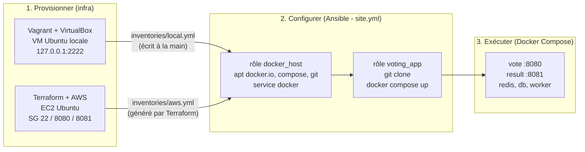

# comptoirs-frontend

Ce projet est un exemple de frontend vue.js sur le backend "comptoirs" [déployé sur heroku](https://springajax.herokuapp.com/).

## Configuration du frontend

### Accès au backend

On [configure un "proxy"](./vite.config.js) pour l'accès au backend, on peut appeler l'api à l'url ```/api/```, la redirection sera faite automatiquement.

### Appel de l'API REST

On définit [une fonction utilitaire pour appeler l'API](./src/api.js), qui facilite l'appel des services REST et permet une meilleure gestion des erreurs côté frontend.

### Vue Router

On utilise le [View router](./router.md) pour gérer la navigation entre les composants Vue.

### Un exemple de composant Vue qui fait un appel à l'API REST

[Le composant qui affiche les catégories](./src/views/CategorieView.vue)

## Installation des dépendances pour le frontend

```sh
npm install
```

### Compilation et exécution pour le développement

```sh
npm run dev
```

### Compilation pour la production

```sh
npm run build
```
